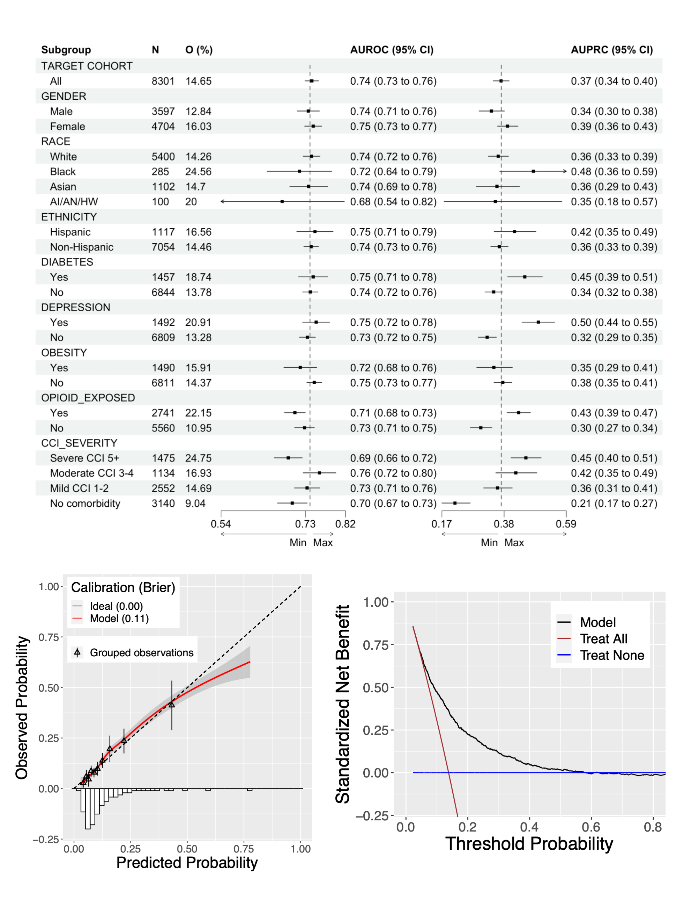

# FairGenEval

An evaluation tool for validating the fairness, bias, and generalizability of ML models developed by the OHDSI [PatientLevelPrediction (PLP)](https://github.com/OHDSI/PatientLevelPrediction) R package.


# Introduction

This package provides an independent evaluation approach to validate the fairness, bias, and generalizability of PLP models over internal and external validation. This package uses the OHDSI PLP model's internal and external validation results to calculate model performance across various population subgroups, such as race, ethnicity, gender, Charlson comorbidity severity groups, and any defined vulnerable and risky groups.

# Features

- Calculates AUROC and AUPRC values for all sub-populations used in evaluation.
- Generates forest plots using AUROC and AUPRC values with outcome distribution on all sub-populations.
- Generates distribution plots for all sub-populations.
- Generates calibration plots for all sub-populations.
- Generates net-benefit plots for all sub-populations.

# Screenshots



# System Requirements

Requires R (version 3.3.0 or higher). Installation on Windows requires [RTools](http://cran.r-project.org/bin/windows/Rtools/).

# Getting Started

## Instalation
To use this package, it should be installed as follows:
```sh
install.packages("remotes")
remotes::install_github("su-boussard-lab/FairGenEval")
```

## usage
This package uses the output RDS file created by [PLP](https://github.com/OHDSI/PatientLevelPrediction) package after validating the PLP model on any OMOP CDM databases. A complete example of using this package is available [here](inst/run.R)

To use this package, a connectionDetails object should be created as follows: 

```sh
connectionDetails <- DatabaseConnector::createConnectionDetails(dbms="dbms name such as, 'bugquery', 'sql server'",
                                                                connectionString="connection string",
                                                                user="user name",
                                                                password="password",
                                                                pathToDriver="path to dbms driver")
```

This package first calculate AUROC and AUPRC for demographics, Charlson comorbidity [severity](https://www.ncbi.nlm.nih.gov/pmc/articles/PMC3891119/#:~:text=The%20severity%20of%20comorbid%20diseases,established%20by%20Charlson%20et%20al) groups and all the clinical subgroups, as follows. It returns the required data for plotting calibration and net-benefits curves, as well as the forest plot.

```sh
allValidationResults <- FairGenEval::generateSubgroupValidationData(connectionDetails=connectionDetails,
                                                                    plpValidationRds="path to plp validation RDS file",
                                                                    evaluationType = "'Test' or 'Validation' or 'weakRecalibration'",
                                                                    subgroupCohortInfo = list())
```

Any subgroup population can be manually generated from the target cohort and stored in the cohort table with a separate cohort definition id. This list can be given to the function above.

```sh
subgroupCohortInfo <- list(list(id =3, name = 'diabetes'), list(id =4, name = 'depression'), list(id =5, name = 'obesity'), list(id =6, name = 'opioid_exposed'))
```

After running the `generateSubgroupValidationData` function, the forest, calibration, and net benefit plots can be generated as follows: 

```sh
FairGenEval::generateMultiForestPlot(resultDataFrame=allValidationResults$validationTable, outputFile=file.path(plotDir, "forest_auroc_auprc.tiff"))

FairGenEval::generateCalibrationPlot(validationResults = allValidationResults, subgroup = "CCI_severity#0", outputFile = file.path(plotDir, "calib_no_comorbidity.pdf"))

FairGenEval::generateNetBenefitPlot(allValidationResults$plpValidationResult, subgroup = "CCI_severity#0", outputFile = file.path(plotDir, "nb_no_comorbidity.pdf"))
```

# Support

Please contact Dr. Behzad Naderalvojoud at behzadn[at]stanford[dot]edu


# License

FairGenEval is licensed under Apache License 2.0

# Development

FairGenEval is being developed in R Studio.


